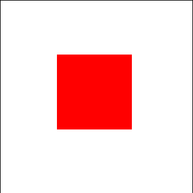
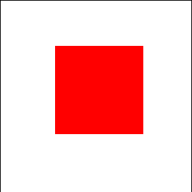
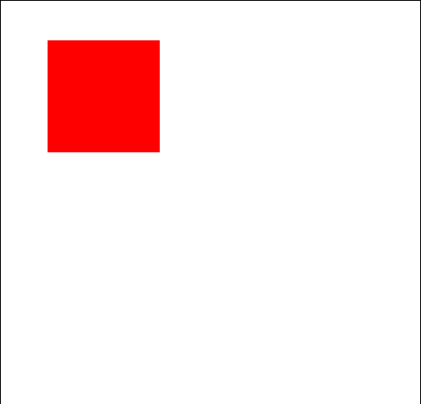

# Implicit Composition Animations in XAML

Implicit Animations are Composition Animations that are used to describe how and when animations occur as a response to direct property changes, such as Opacity or Offset. Show and Hide animations describe the animation to be applied to an element when the Visibility is changed, or the element is added/removed to the visual tree.

**Prerequisites** - [Composition Animation in XAML](https://docs.microsoft.com/windows/communitytoolkit/animations/compositionanimations)

The Implicit Animations Attached Properties enable implicit animations to be defined in your XAML code by using the [Composition Animation](https://docs.microsoft.com/windows/communitytoolkit/animations/compositionanimations) XAML objects. This allows animations to be defined directly on the element, or defined as XAML resources and applied to any XAML element. 

The Implicit Animations Attached Properties can be used in combination with the [VisualExtensions](https://docs.microsoft.com/windows/communitytoolkit/extensions/visualex). This works well when used in Storyboards.

## Syntax

```xaml
<Page ...
     xmlns:animations="using:Microsoft.Toolkit.Uwp.UI.Animations"/>

<Border>

    <animations:Implicit.ShowAnimations>
        <animations:TranslationAnimation Duration="0:0:1" To="0, 0, 0"></animations:TranslationAnimation>
        <animations:OpacityAnimation Duration="0:0:1" To="1.0"></animations:OpacityAnimation>
    </animations:Implicit.ShowAnimations>

    <animations:Implicit.HideAnimations>
        <animations:ScalarAnimation Target="Opacity" Duration="0:0:1" To="0.0"></animations:ScalarAnimation>
        <animations:ScalarAnimation Target="Translation.Y" Duration="0:0:1" To="-200">
            <animations:ScalarKeyFrame Key="0.1" Value="30"></animations:ScalarKeyFrame>
            <animations:ScalarKeyFrame Key="0.5" Value="0.0"></animations:ScalarKeyFrame>
        </animations:ScalarAnimation>
    </animations:Implicit.HideAnimations>

    <animations:Implicit.Animations>
        <!-- Notice this animation does not have a From/To value or any KeyFrames. In this case, an ExpressionKeyFrame will be added of Value=this.FinalValue -->
        <animations:Vector3Animation Target="Offset"  Duration="0:0:1"></animations:Vector3Animation>

        <!-- Notice this animation specifies an ImplicitTarget different from Target. In this case, the animation will run when the Offset is changed -->
        <animations:ScalarAnimation Target="RotationAngleInDegrees" ImplicitTarget="Offset"  Duration="0:0:1.2" From="0" To="0">
            <animations:ScalarKeyFrame Key="0.9" Value="80"></animations:ScalarKeyFrame>
        </animations:ScalarAnimation>

        <animations:Vector3Animation Target="Scale" Duration="0:0:1"></animations:Vector3Animation>
    </animations:Implicit.Animations>

</Border>
```

## Properties

### Implicit.Animations
Specifies an [Composition Animation](https://docs.microsoft.com/windows/communitytoolkit/animations/compositionanimations) with animations to run when properties are modified.

### Implicit.ShowAnimations and Implicit.HideAnimations
Specifies an [Composition Animation](https://docs.microsoft.com/windows/communitytoolkit/animations/compositionanimations) with animations to run when an element is added or removed from the visual tree respectively (including when Visibility on an element is changed).

## Examples

- Let's create a scaling animation.

    ```xaml
    <Border x:Name="Element" Height="100" Width="100" Background="Red">
        <animations:Implicit.Animations>
            <animations:ScaleAnimation Duration="0:0:1"/>
        </animations:Implicit.Animations>
    </Border>
    ```
    

- Let's create blink animation to show and hide controls.

    ```xaml
    <Border x:Name="Element" Height="100" Width="100" Background="Red">
        <animations:Implicit.ShowAnimations>
            <animations:OpacityAnimation Duration="0:0:1" From="0" To="1">
                <animations:ScalarKeyFrame Key="0.2" Value="0.6"/>
                <animations:ScalarKeyFrame Key="0.4" Value="0.3"/>
                <animations:ScalarKeyFrame Key="0.6" Value="0.8"/>
                <animations:ScalarKeyFrame Key="0.8" Value="0.5"/>
            </animations:OpacityAnimation>
        </animations:Implicit.ShowAnimations>

        <animations:Implicit.HideAnimations>
            <animations:OpacityAnimation Duration="0:0:1" From="1" To="0">
                <animations:ScalarKeyFrame Key="0.2" Value="0.5"/>
                <animations:ScalarKeyFrame Key="0.4" Value="0.8"/>
                <animations:ScalarKeyFrame Key="0.6" Value="0.3"/>
                <animations:ScalarKeyFrame Key="0.8" Value="0.6"/>
            </animations:OpacityAnimation>
        </animations:Implicit.HideAnimations>
    </Border>
    ```
    Now, when you set `Element.Visibility = Visibility.Collapsed` the HideAnimations will run and when you set `Element.Visibility = Visibility.Visible` the ShowAnimations will run.

    

- Now, we can create a rotating animation whenever offset changes. This time we can use [Resources](https://docs.microsoft.com/windows/uwp/design/controls-and-patterns/resourcedictionary-and-xaml-resource-references) to set Implicit Animations.

    ```xaml
    <Page ...
        xmlns:animations="using:Microsoft.Toolkit.Uwp.UI.Animations"
        xmlns:extensions="using:Microsoft.Toolkit.Uwp.UI.Extensions"/>

        <Page.Resources>
            <animations:AnimationCollection x:Key="OffRotAnim">
                <animations:OffsetAnimation Duration="0:0:1"/>
                <animations:ScalarAnimation Target="RotationAngleInDegrees" ImplicitTarget="Offset"  Duration="0:0:1">
                    <animations:ExpressionKeyFrame Key="1" Value="This.StartingValue + 90"/>
                </animations:ScalarAnimation>
            </animations:AnimationCollection>
        </Page.Resources>

        <Border x:Name="Element" Height="100" Width="100" Background="Red"
            extensions:VisualEx.NormalizedCenterPoint="0.5,0.5,0" animations:Implicit.Animations="{StaticResource OffRotAnim}"/>
    </Border>
    ```
    

## Requirements

| Device family | Universal, 10.0.15063.0 or higher   |
| ---------------------------------------------------------------- | ----------------------------------- |
| Namespace                                                        | Microsoft.Toolkit.Uwp.UI.Animations |
| NuGet package | [Microsoft.Toolkit.Uwp.UI.Animations](https://www.nuget.org/packages/Microsoft.Toolkit.Uwp.UI.Animations/) |

## API

* [Implicit animations source code](https://github.com/Microsoft/WindowsCommunityToolkit//tree/master/Microsoft.Toolkit.Uwp.UI.Animations/Implicit.cs)

## Related Topics

- [Visual layer](https://docs.microsoft.com/windows/uwp/composition/visual-layern)
- [Composition animations](https://docs.microsoft.com/windows/uwp/composition/composition-animation)
- [ExpressionAnimation](https://docs.microsoft.com/uwp/api/Windows.UI.Composition.ExpressionAnimation)