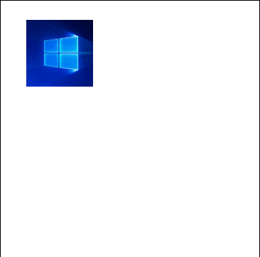

# Offset

The Offset animation is used to move the control from one place to another. Offset animation is applied to all the XAML elements in its parent control/panel. Offset animation doesn't affect the functionality of the control.

## Syntax

**XAML**

```xaml
<Page ...
    xmlns:interactivity="using:Microsoft.Xaml.Interactivity"  
    xmlns:behaviors="using:Microsoft.Toolkit.Uwp.UI.Animations.Behaviors"/>

<interactivity:Interaction.Behaviors>
    <behaviors:Offset x:Name="OffsetBehavior" 
            OffsetX="25.0" 
            OffsetY="25.0"
            Duration="2500" 
            Delay="250" 
            EasingType="Linear"
            AutomaticallyStart="True"/>
</interactivity:Interaction.Behaviors>
```

**C#**

```csharp
MyUIElement.Offset(offsetX: 25, offsetY: 25, duration: 2500, delay: 250, easingType: EasingType.Default).Start();
await MyUIElement.Offset(offsetX: 25, offsetY: 25, duration: 2500, delay: 250, easingType: EasingType.Default).StartAsync();  //Offset animation can be awaited
```

## Sample Output


## Properties

### EasingType

You can change the way how the animation interpolates between keyframes by defining the EasingType.

| EasingType | Explanation                                                                                                | Graphical Explanation                      |
| ---------- | ---------------------------------------------------------------------------------------------------------- | ------------------------------------------ |
| Default    | Creates an animation that accelerates with the default EasingType which is specified in AnimationExtensions.DefaultEasingType which is by default Cubic |                                                                                                                           |
| Linear     | Creates an animation that accelerates or decelerates linear                                                                                             |                                                                                                                           |
| Back       | Retracts the motion of an animation slightly before it begins to animate in the path indicated                                                          |            |
| Bounce     | Creates a bouncing effect                                                                                                                               |        |
| Circle     | Creates an animation that accelerates or decelerates using a circular function                                                                          |        |
| Cubic      | Creates an animation that accelerates or decelerates using the formula f(t) = t3                                                                        |          |
| Elastic    | Creates an animation that resembles a spring oscillating back and forth until it comes to rest                                                          |      |
| Quadratic  | Creates an animation that accelerates or decelerates using the formula f(t) = t2                                                                        |  |
| Quartic    | Creates an animation that accelerates or decelerates using the formula f(t) = t4                                                                        |      |
| Quintic    | Create an animation that accelerates or decelerates using the formula f(t) = t5                                                                         |      |
| Sine       | Creates an animation that accelerates or decelerates using a sine formula                                                                               |            |

## Examples

- You can just call `Offset()` set the control in the orginal position

    **Sample Code**

    ```csharp
    await MyUIElement.Offset().Start();
    ```
- Use await to create a continous movement

    **Sample Code**

    ```csharp
    public async void OffsetAsync()
    {
        await MyUIElement.Offset(offsetX: 100, duration:1000).StartAsync();
        await MyUIElement.Offset(offsetX: 100, offsetY: 100, duration: 1000).StartAsync();
        await MyUIElement.Offset(offsetX: 0, offsetY:100, duration: 1000).StartAsync();
        await MyUIElement.Offset(duration: 1000).StartAsync();
    }
    ```

    **Sample Output**

    

- Use this to create chaining animations with other animations. Visit the [AnimationSet](AnimationSet.md) documentation for more information.

    **Sample Code**

    ```csharp
    var anim = MyUIElement.Light(5).Offset(offsetX: 100, offsetY: 100).Saturation(0.5).Scale(scaleX: 2, scaleY: 2);
    anim.SetDurationForAll(2500);
    anim.SetDelay(250);
    anim.Completed += animation_completed;
    anim.Start();
    ```

    **Sample Output**

    

## Sample Project

[Offset Behavior Sample Page Source](https://github.com/Microsoft/UWPCommunityToolkit/tree/master/Microsoft.Toolkit.Uwp.SampleApp/SamplePages/Offset). You can see this in action in [UWP Community Toolkit Sample App](https://www.microsoft.com/store/apps/9NBLGGH4TLCQ).

## Requirements

| [Device family](http://go.microsoft.com/fwlink/p/?LinkID=526370) | Universal, 10.0.14393.0 or higher   |
| ---------------------------------------------------------------- | ----------------------------------- |
| Namespace                                                        | Microsoft.Toolkit.Uwp.UI.Animations |
| NuGet package | [Microsoft.Toolkit.Uwp.UI.Animations](https://www.nuget.org/packages/Microsoft.Toolkit.Uwp.UI.Animations/) |

## API

* [Offset source code](https://github.com/Microsoft/UWPCommunityToolkit/blob/master/Microsoft.Toolkit.Uwp.UI.Animations/Behaviors/Offset.cs)
