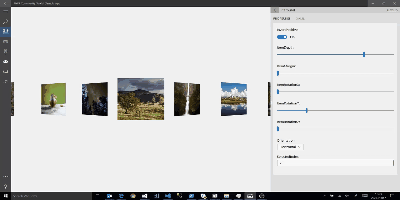
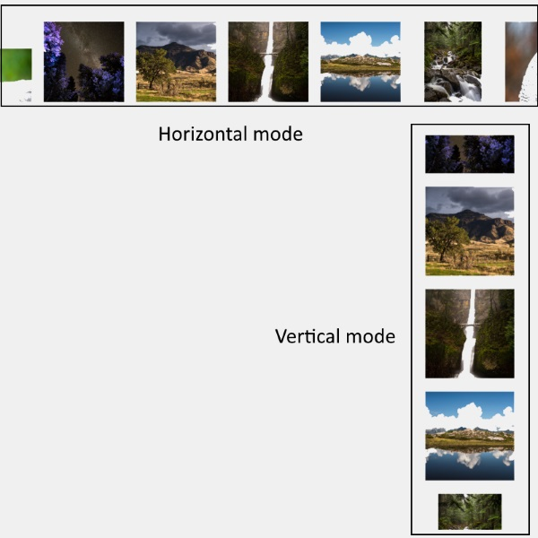

# Carousel XAML Control 

The `Carousel` control provides a new control, inherited from the `ItemsControl`, representing a nice and smooth carousel.  
This control lets you specify a lot of properties for a flexible layouting.  
The `Carousel` control works fine with mouse, touch, mouse and keyboard as well. 

  

## Syntax

```xaml
<controls:Carousel x:Name="CarouselControl"
    InvertPositive="{Binding InvertPositive.Value, Mode=OneWay}"
    ItemDepth="{Binding ItemDepth.Value, Mode=OneWay}"
    ItemMargin="{Binding ItemMargin.Value, Mode=OneWay}"
    ItemRotationX="{Binding ItemRotationX.Value, Mode=OneWay}"
    ItemRotationY="{Binding ItemRotationY.Value, Mode=OneWay}"
    ItemRotationZ="{Binding ItemRotationZ.Value, Mode=OneWay}"
    Orientation="{Binding Orientation.Value, Mode=OneWay}"
    SelectedIndex="{Binding SelectedIndex.Value, Mode=TwoWay}">

    <controls:Carousel.EasingFunction>
        <CubicEase EasingMode="EaseOut" />
    </controls:Carousel.EasingFunction>

    <controls:Carousel.ItemTemplate>
        <DataTemplate>
            <Image Width="200"
                Height="200"
                VerticalAlignment="Bottom"
                Source="{Binding Thumbnail}"
                Stretch="Uniform" />
        </DataTemplate>
    </controls:Carousel.ItemTemplate>
</controls:Carousel>
```

## Carousel Properties

### Orientation

You can customize the `Carousel` orientation by setting the `Orientation` property.   
The carousel control use a known property from `Windows.UI.Xaml.Controls` to provide a `Vertical` or `Horizontal` orientation.  

```csharp
namespace Windows.UI.Xaml.Controls
{
    public enum Orientation
    {
        // The control or layout should be vertically oriented.
        Vertical = 0,
        // The control or layout should be horizontally oriented.
        Horizontal = 1
    }
}
```
  

### ItemDepth

The ItemDepth specify the depth beetween the centered (and so the selected) item and all others items.

```csharp
/// <summary>
/// Gets or sets depth of non Selected Items
/// </summary>
public int ItemDepth
{
    get;
    set;
}
```

  
*Set ItemDepth to 0*

  
*Set ItemDepth to 400*

### ItemMargin

The ItemMargin specifies the margin beetween each items, excepting the selected item.

```csharp
/// <summary>
/// Gets or sets margin of non Selected Items
/// </summary>
public int ItemMargin
{
    get;
    set;
}
```
  
*Set ItemMargin to 0*

  
*Set ItemMargin to 150*

### ItemRotation X,Y,Z

The `ItemRotationX`, `ItemRotationY`, `ItemRotationZ` properties specify the rotation applied on all items, excepting the selected item.

```csharp
/// <summary>
/// Gets or sets rotation on X axis of non Selected Items
/// </summary>
public int ItemRotationX
{
    get;
    set;
}

/// <summary>
/// Gets or sets rotation on Y axis of non Selected Items
/// </summary>
public int ItemRotationY
{
    get;
    set;
}

/// <summary>
/// Gets or sets rotation on Z axis of non Selected Items
/// </summary>
public int ItemRotationZ
{
    get;
    set;
}                
```

  
*Set ItemRotation on X,Y,Z*

### InvertPositive

The `InvertPositive` property specifies which behavior to apply to items on left and right (or up and down)   
If **false**, all the items (except the selected item) will have the exact same transformations.  
If **true**, all the items where `index` > `SelectedIndex` will have an opposite tranformation (Rotation X Y and Z will be multiply by -1)

  
*Set InvertPositive to false*

  
*Set InvertPositive to true*

## Default Template 

[Carousel XAML File](https://github.com/Microsoft/UWPCommunityToolkit/blob/master/Microsoft.Toolkit.Uwp.UI.Controls/Carousel/Carousel.xaml) is the XAML template used in the toolkit for the default styling.

## Requirements (Windows 10 Device Family)

| [Device family](http://go.microsoft.com/fwlink/p/?LinkID=526370) | Universal, 10.0.14393.0 or higher |
| --- | --- |
| Namespace | Microsoft.Toolkit.Uwp.UI.Controls |

## API

* [Carousel source code](https://github.com/Microsoft/UWPCommunityToolkit/tree/master/Microsoft.Toolkit.Uwp.UI.Controls/Carousel)

