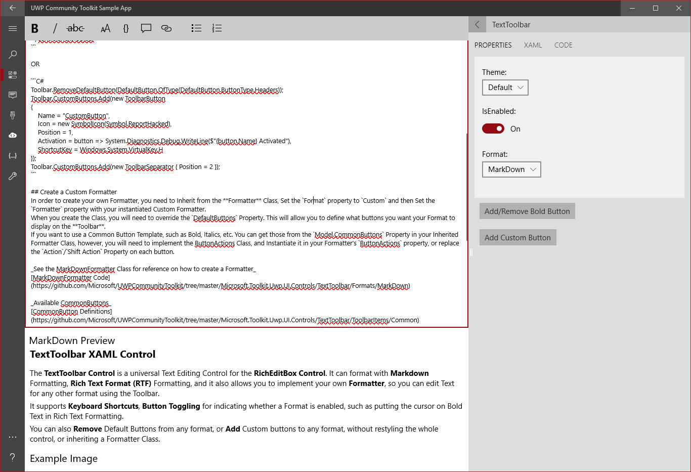

# TextToolbar XAML Control

The **TextToolbar Control** is a universal Text Editing Control for the **RichEditBox Control**. It can format with **Markdown** Formatting, **Rich Text Format (RTF)** Formatting, and it also allows you to implement your own **Formatter**, so you can edit Text for any other format using the Toolbar.
It supports **Keyboard Shortcuts**, **Button Toggling** for indicating whether a Format is enabled, such as putting the cursor on Bold Text in Rich Text Formatting.
You can also **Remove** Default Buttons from any format, or **Add** Custom buttons to any format, without restyling the whole control, or inheriting a Formatter Class.

## Example Image



## Example Code

[TextToolbar Sample Page](https://github.com/Microsoft/UWPCommunityToolkit/tree/master/Microsoft.Toolkit.Uwp.SampleApp/SamplePages/TextToolbar)

## Syntax

### UI Layout

```xaml
<controls:TextToolbar x:Name="Toolbar" Editor="{x:Bind Editor}" Format="MarkDown" />
<RichEditBox x:Name="Editor" PlaceholderText="Enter Text Here" />
```
### How to Remove/Add Buttons

```xaml
<controls:TextToolbar x:Name="Toolbar" Editor="{x:Bind Editor}">
    <controls:TextToolbar.ButtonModifications>
        <buttons:DefaultButton Type="Headers" IsVisible="False"/>
    </controls:TextToolbar.ButtonModifications>
    <controls:TextToolbar.CustomButtons>
        <buttons:ToolbarButton
            Name="CustomButton"
			Icon="ReportHacked"
            Position="1"
            Activation="{x:Bind System.Action<ToolbarButton>}"
            ShortcutKey="H" />
        <buttons:ToolbarSeparator Position="2" />
    </controls:TextToolbar.CustomButtons>
</controls:TextToolbar>
```

_OR_

```C#
var button = Toolbar.GetDefaultButton(ButtonType.Headers);
button.Visibility = Windows.UI.Xaml.Visibility.Collapsed;
Toolbar.CustomButtons.Add(new ToolbarButton
{
    Name = "CustomButton",
    Icon = new SymbolIcon(Symbol.ReportHacked),
    Position = 1,
    Activation = button => System.Diagnostics.Debug.WriteLine($"{button.Name} Activated"),
    ShortcutKey = Windows.System.VirtualKey.H
});
Toolbar.CustomButtons.Add(new ToolbarSeparator { Position = 2 });
```

## Create a Custom Formatter

In order to create your own Formatter, you need to Inherit from the **Formatter** Class. Then on the TextToolbar, Set the `Format` property to `Custom` and then Set the `Formatter` property with your instantiated Custom Formatter.

When you create the Class, you will need to override the `DefaultButtons` Property. This will allow you to define what buttons you want your Format to display on the **Toolbar**.

If you want to use a Common Button Template, such as Bold, Italics, etc. You can get those by Instantiating a `CommonButtons` Instance in your Formatter Class, however, you will need to implement the **ButtonActions** Class, and Instantiate it in your Formatter's `ButtonActions` property, or replace the `Action`/`Shift Action` Property on each button you use.

**_See the MarkDownFormatter Class for reference on how to create a Formatter:_**
[MarkDownFormatter Code](https://github.com/Microsoft/UWPCommunityToolkit/tree/master/Microsoft.Toolkit.Uwp.UI.Controls/TextToolbar/Formats/MarkDown)

**_See the Sample Formatter Class from the Sample App:_**
[SampleFormatter Code](https://github.com/Microsoft/UWPCommunityToolkit/tree/master/Microsoft.Toolkit.Uwp.SampleApp/SamplePages/TextToolbar/SampleFormatter.cs)

**_Available CommonButtons:_**
[CommonButton Definitions](https://github.com/Microsoft/UWPCommunityToolkit/tree/master/Microsoft.Toolkit.Uwp.UI.Controls/TextToolbar/ToolbarItems/Common)

## Properties

| Property | Description |
| --- | --- |
| Editor | Gets or sets the RichEditBox to Attach to, this is required for any formatting to work. |
| Format | Gets or sets which formatter to use, and which buttons to provide. |
| Formatter | Gets or sets the formatter instance which is used to format the text, using the buttons and shortcuts. |
| DefaultButtons | Gets the default buttons for this format. |
| CustomButtons | Gets or sets a list of buttons to add on top of the Default Button set. |
| ButtonModifications | Gets or sets a list of Default buttons to Modify. |
| Labels | Gets or sets the default string Labels |
| LastKeyPress | Gets the last key pressed using the Editor. |
| UseURIChecker | Gets or sets a value indicating whether to enable use of URI Checker for Link Creator. This allows you to verify Absolute URIs, before creating the Link. |

## Requirements (Windows 10 Device Family)

| [Device family](http://go.microsoft.com/fwlink/p/?LinkID=526370) | Universal, 10.0.14393.0 or higher |
| --- | --- |
| Namespace | Microsoft.Toolkit.Uwp.UI.Controls |

## API

* [TextToolbar source code](https://github.com/Microsoft/UWPCommunityToolkit/tree/master/Microsoft.Toolkit.Uwp.UI.Controls/TextToolbar)