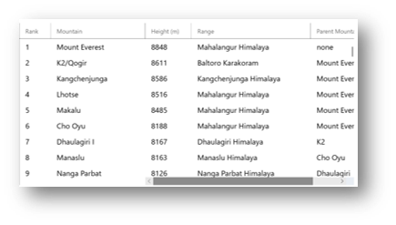

# How to - Customize the DataGrid control through UI formatting options

The [DataGrid](../datagrid.md) control supports various styling and formatting options both through XAML at design time as well as procedurally in code. Some of the common ways to customize the look and feel of the DataGrid control include the following:

## 1. GridLines
You can control the visibility of the grid lines separating inner cells using the **DataGrid.GridLinesVisibility** property. The **DataGridGridLinesVisibility** enumeration has the following member values:
   * *None*: No grid lines are shown
   * *Horizontal*: Only horizontal grid lines, which separate rows, are shown.
   * *Vertical*: Only vertical grid lines, which separate columns, are shown.
   * *All*: Both horizontal and vertical grid lines are shown. 

You can also change the color of the gridlines using **HorizontalGridLinesBrush** and/or **VerticalGridLinesBrush** properties.

```xml
<controls:DataGrid GridLinesVisibility="All"/>
```


## 2. Alternating rows
You can set the **RowBackground**, **RowForeground**, **AlternatingRowBackground** and **AlternatingRowForeground** properties to desired brushes and create customized alternating rows for your DataGrid control.

The RowBackground and RowForeground properties are used to paint the background and foreground of all rows in the DataGrid control. If AlternatingRowBackground and/or AlternatingRowForeground properties are not null, their values override the RowBackground and RowForeground values for odd-numbered rows.

```xml
<controls:DataGrid AlternatingRowBackground="LightGray"/>
```


## 3. Headers visibility
You can toggle the visibility of row and column headers using the **DataGrid.HeadersVisibility** property. The **DataGridHeadersVisibility** enumeration has the following member values:
   * *All*: Both column and row header cells are displayed.
   * *Column*: Only column header cells are displayed.
   * *Row*: Only column header cells are displayed.
   * *None*: No header cells are displayed.

Note: By default, DataGrid row headers are not displayed. To display row headers, the **HeadersVisibility** property must be set to *DataGridHeadersVisibility.Row* or *DataGridHeadersVisibility.All* and the DataGrid's ControlTemplate should be altered to provide a visual for the RowHeader as desired.

```xml
<controls:DataGrid HeadersVisibility="Column"/>
```


## 4. Customizable templates and styling for cells, rows and headers

All individual parts of the DataGrid control are customizable through simple Style properties such as:
   * *CellStyle* : style that is used when rendering the data grid cells.
   * *RowStyle* : style that is used when rendering the rows.
   * *ColumnHeaderStyle* : style that is used when rendering the column headers.
   * *RowGroupHeaderStyles* : style that is used when rendering the row group header. The DataGrid control currently supports one-level grouping only - the first style specified as part of RowGroupHeaderStyles will be applied to the row group header.
   * *RowHeaderStyle* : style that is used when rendering the row headers. The DataGrid control does not have a default visual for the row header. If you would like to alter a row header visual, you should first provide one by altering the DataGrid's control template.

Whether defined as an inline style or as a resource, the Style defines the appearance of cells/rows/columns/headers in the data grid, and should specify the appropriate TargetType (say, **DataGridCell** for CellStyle). You typically specify setters for individual properties, and might also use a setter for the Template property if you wanted to change the composition of elements.

You can also use properties such as **RowHeight**, **RowHeaderWidth**, **ColumnWidth**, **ColumnHeaderHeight** etc., to customize the sizing of the various parts of the DataGrid control.

```xml
<controls:DataGrid CellStyle="{StaticResource cellStyle}" />

<controls:DataGridTemplateColumn Header="Range" CellTemplate="{StaticResource cellTemplate}" />
```

## 5. Frozen columns
Frozen columns are columns that are always displayed and cannot be scrolled out of visibility. Frozen columns are always the leftmost columns in display order. You cannot drag frozen columns into the group of unfrozen columns or drag unfrozen columns into the group of frozen columns. Set the **DataGrid.FrozenColumnCount** property to the desired number of columns that the user should not scroll horizontally.

```xml
<controls:DataGrid FrozenColumnCount="2"/>
```


## 6. Reorder and resize columns
You can allow users to: 
   * Adjust all column widths using mouse/touch/pen through the **DataGrid.CanUserResizeColumns** property. 
   * Change the column display order by dragging the column headers using mouse/touch/pen through the **DataGrid.CanUserReorderColumns** property.
   * Set this behavior for individual columns by setting the **DataGridColumn.CanUserReorder/CanUserResize** properties. If the individual column properties and the global DataGrid.** properties are both set, a value of false will take precedence over a value of true.

```xml
<controls:DataGrid CanUserReorderColumns="True" CanUserResizeColumns="True"/>
```


## See Also

* [Add a DataGrid control to a page](datagrid_basics.md)
* [Sizing options in the DataGrid control](sizing_options.md)
* [Default keybaord navigation and selection patterns](keyboard_navigation_selection.md)
* [Display and configure Row Details](rowdetails.md)
* [Configure Auto-generated columns in the DataGrid control](customize_autogenerated_columns.md)
* [Group, sort and filter data using LINQ and the DataGrid control](group_sort_filter.md)
* [Editing and input validation in the DataGrid control](editing_inputvalidation.md)
* [DataGrid Sample Page Source](https://github.com/Microsoft/WindowsCommunityToolkit//tree/harinikmsft/datagrid/Microsoft.Toolkit.Uwp.SampleApp/SamplePages/DataGrid)
