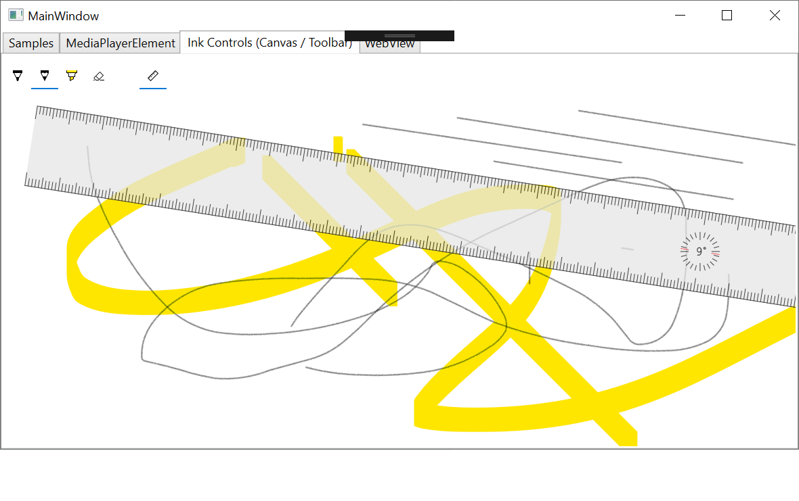

# InkToolbar Control for Windows Forms and WPF

> [!NOTE]
> This control is currently available as a developer preview. Although we encourage you to try out this control in your own prototype code now, we do not recommend that you use it in production code at this time. This control will continue to mature and stabilize in future toolkit releases.

The **InkToolbar** control provides an interface to manage an [InkCanvas](InkCanvas.md) for Windows Ink-based user interaction in your Windows Forms or WPF desktop application.



## About InkToolbar control

The WPF version of this control is located in the **Microsoft.Toolkit.Wpf.UI.Controls** namespace. The Windows Forms version is located in the **Microsoft.Toolkit.Forms.UI.Controls** namespace. You can find additional related types (such as enums and event args classes) in the **Microsoft.Toolkit.Win32.UI.Controls.Interop.WinRT** namespace.

This control wraps an internal instance of the UWP [Windows.UI.Xaml.Controls.InkToolbar](https://docs.microsoft.com/uwp/api/Windows.UI.Xaml.Controls.InkToolbar) control.

## Syntax
```xaml
<Window x:Class="TestSample.MainWindow" ...
  xmlns:controls="clr-namespace:Microsoft.Toolkit.Wpf.UI.Controls;assembly=Microsoft.Toolkit.Wpf.UI.Controls"
...>


<controls:InkToolbar  DockPanel.Dock="Top" x:Name="inkToolbar" Grid.Row="0" TargetInkCanvas="{x:Reference Name=inkCanvas}"    
      Initialized="inkToolbar_Initialized" ActiveToolChanged="inkToolbar_ActiveToolChanged"
      InkDrawingAttributesChanged="inkToolbar_InkDrawingAttributesChanged"
      IsStencilButtonCheckedChanged="inkToolbar_IsStencilButtonCheckedChanged"  >
    <controls:InkToolbarCustomToolButton x:Name="toolButtonLasso" />
</controls:InkToolbar>
```

## Properties

The following properties wrap corresponding [properties](https://docs.microsoft.com/uwp/api/Windows.UI.Xaml.Controls.InkToolbar#properties) of the internal UWP [Windows.UI.Xaml.Controls.InkToolbar](https://docs.microsoft.com/uwp/api/Windows.UI.Xaml.Controls.InkToolbar) object. See the links in this table for more information about each property.

| Property | Type | Description |
| -- | -- | -- |
| ActiveTool | WindowsXamlHostBaseExt | Wraps the [ActiveTool](https://docs.microsoft.com/uwp/api/windows.ui.xaml.controls.inktoolbar.activetool) property. |
| ActiveToolProperty | DependencyProperty | Dependency property for the **ActiveTool** property. |
| ButtonFlyoutPlacement | InkToolbarButtonFlyoutPlacement | Wraps the [ButtonFlyoutPlacement](https://docs.microsoft.com/uwp/api/windows.ui.xaml.controls.inktoolbar.buttonflyoutplacement) property. |
| ButtonFlyoutPlacementProperty | DependencyProperty | Dependency property for the **ButtonFlyoutPlacement** property. |
| Children | ObservableCollection&lt;DependencyObject&gt; | Wraps the [Children](https://docs.microsoft.com/uwp/api/windows.ui.xaml.controls.inktoolbar.children) property. |
| InitialControls | InkToolbarInitialControls  | Wraps the [InitialControls](https://docs.microsoft.com/uwp/api/windows.ui.xaml.controls.inktoolbar.initialcontrols) property. |
| InitialControlsProperty | DependencyProperty | Dependency property for the **InitialControls** property. |
| InkDrawingAttributes | InkDrawingAttributes | Wraps the [InkDrawingAttributes](https://docs.microsoft.com/uwp/api/windows.ui.xaml.controls.inktoolbar.inkdrawingattributes) property.  |
| InkDrawingAttributesProperty | DependencyProperty | Dependency property for the **InkDrawingAttributes** property. |
| IsRulerButtonChecked | bool | Wraps the [IsRulerButtonChecked](https://docs.microsoft.com/uwp/api/windows.ui.xaml.controls.inktoolbar.isrulerbuttonchecked) property. |
| IsRulerButtonCheckedProperty | DependencyProperty | Dependency property for the **IsRulerButtonChecked** property. |
| IsStencilButtonChecked | bool | Wraps the [IsStencilButtonChecked](https://docs.microsoft.com/uwp/api/windows.ui.xaml.controls.inktoolbar.isstencilbuttonchecked) property. |
| IsStencilButtonCheckedProperty | DependencyProperty | Dependency property for the **IsStencilButtonChecked** property. |
| Orientation | Orientation | Wraps the [Orientation](https://docs.microsoft.com/uwp/api/windows.ui.xaml.controls.inktoolbar.orientation) property. |
| OrientationProperty | DependencyProperty | Dependency property for the **Orientation** property. |
| TargetInkCanvas | InkCanvas | Wraps the [TargetInkCanvas](https://docs.microsoft.com/uwp/api/windows.ui.xaml.controls.inktoolbar.inkcanvas) property. |
| TargetInkCanvasProperty | DependencyProperty | Dependency property for the **TargetInkCanvas** property. |

## Events

The following events wrap corresponding [events](https://docs.microsoft.com/uwp/api/Windows.UI.Xaml.Controls.InkToolbar#events) of the internal UWP [Windows.UI.Xaml.Controls.InkToolbar](https://docs.microsoft.com/uwp/api/Windows.UI.Xaml.Controls.InkToolbar) object. See the links in this table for more information about each property.

| Event | Description |
| -- | -- |
| ActiveToolChanged | Wraps the [ActiveToolChanged](https://docs.microsoft.com/uwp/api/windows.ui.xaml.controls.inktoolbar.activetoolchanged) event. |
| EraseAllClicked | Wraps the [EraseAllClicked](https://docs.microsoft.com/uwp/api/windows.ui.xaml.controls.inktoolbar.eraseallclicked) event. |
| IsRulerButtonCheckedChanged | Wraps the [IsRulerButtonCheckedChanged](https://docs.microsoft.com/uwp/api/windows.ui.xaml.controls.inktoolbar.isrulerbuttoncheckedchanged) event. |
| IsStencilButtonCheckedChanged | Wraps the [IsStencilButtonCheckedChanged](https://docs.microsoft.com/uwp/api/windows.ui.xaml.controls.inktoolbar.isstencilbuttoncheckedchanged) event. |


## Requirements

|        |        |
|--------|--------|
| Device family | .NET 4.6.2, Windows 10 (introduced v10.0.17709.0) |
| Namespace | Windows Forms: Microsoft.Toolkit.Forms.UI.Controls <br/> WPF: Microsoft.Toolkit.Wpf.UI.Controls |
| NuGet package | Windows Forms: [Microsoft.Toolkit.Forms.UI.Controls](https://www.nuget.org/packages/Microsoft.Toolkit.Forms.UI.Controls)  <br/> WPF: [Microsoft.Toolkit.Wpf.UI.Controls](https://www.nuget.org/packages/Microsoft.Toolkit.Wpf.UI.Controls) |

## API Source Code

- [InkToolbar (Windows Forms)](https://github.com/Microsoft/WindowsCommunityToolkit/tree/master/Microsoft.Toolkit.Win32/Microsoft.Toolkit.Forms.UI.Controls/InkToolbar)
- [InkToolbar (WPF)](https://github.com/Microsoft/WindowsCommunityToolkit/tree/master/Microsoft.Toolkit.Win32/Microsoft.Toolkit.Wpf.UI.Controls/InkToolbar)


## Related Topics

- [InkToolbar (UWP)](https://docs.microsoft.com/uwp/api/Windows.UI.Xaml.Controls.InkToolbar)
- [Pen and Windows Ink](https://docs.microsoft.com/windows/uwp/design/input/pen-and-stylus-interactions)
