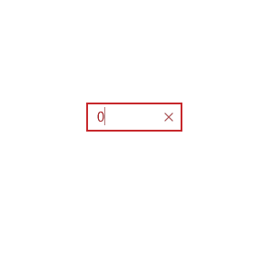

# SurfaceDialTextboxHelper XAML Property

The **SurfaceDialTextboxHelper XAML Property** adds features from the Surface Dial control to a numeric TextBox. This enables you to modify the content of the TextBox when rotating the Surface Dial (increasing or decreasing the value) and optionally go to the next focus element by tapping the Surface Dial click button.

## Properties

**StepValue**: Required
This property enables the Textbox with the Surface Dial controller, and control the amount each rotation step of the Surface Dial modifies the TextBox.

**ForceMenuItem**: Required
The Surface Dial requires the app to add a menu item to the Surface Dial context menu for it to function in the app. If you don't have a Surface Dial controller elsewhere in the app, set this field to True. This will add a menu item to the Contect Menu when you modify a Surface Dial enabled Textbox. If you already have a Surface Dial controller elsewhere in the app, you can set the Controller property to the same one to reuse it. Use the Icon property to modify the icon you wish to use. Typically, a user will not see this item unless you open the Context Menu while a Textbox is in focus.

**EnableHapticFeedback**: Optional
This property makes it possible to turn on or off the haptic feedback on the Surface Dial hardware while rotating.

**EnableMinMaxValue**: Optional
This property enables the MinValue and MaxValue limits of the Textbox. These values are used to limit the value in the TextBox while rotating the Surface Dial.

**EnableTapToNextControl**: Optional
Enables you to click the Surface Dial Control to move to the next focus item in your UI. Good for quickly navigating between Textbox elements on your UI.

> [!NOTE] Windows Anniversary Update (10.0.14393.0) is required for this helper to work correctly.

## Syntax

```xaml
<TextBox Width="106"
          HorizontalAlignment="Left"
          VerticalAlignment="Top"
          extensions:SurfaceDialTextboxHelper.EnableHapticFeedback="True"
          extensions:SurfaceDialTextboxHelper.EnableMinMaxValue="True"
          extensions:SurfaceDialTextboxHelper.EnableTapToNextControl="False"
          extensions:SurfaceDialTextboxHelper.ForceMenuItem="True"
          extensions:SurfaceDialTextboxHelper.Icon="Ruler"
          extensions:SurfaceDialTextboxHelper.MaxValue="0"
          extensions:SurfaceDialTextboxHelper.MinValue="100"
          extensions:SurfaceDialTextboxHelper.StepValue="1"
          Text="0" />  
```

## Example Image



## Example Code

[SurfaceDialTextboxHelper Sample Page](https://github.com/Microsoft/UWPCommunityToolkit/tree/master/Microsoft.Toolkit.Uwp.SampleApp/SamplePages/SurfaceDialTextboxHelper)

## Requirements (Windows 10 Device Family)

| [Device family](http://go.microsoft.com/fwlink/p/?LinkID=526370) | Universal, 10.0.14393.0 or higher |
| --- | --- |
| Namespace | Microsoft.Toolkit.Uwp.UI.Extensions |

## API

* [SurfaceDialTextboxHelper source code](https://github.com/Microsoft/UWPCommunityToolkit/tree/master/Microsoft.Toolkit.Uwp.UI/Extensions/SurfaceDialTextboxHelper)
