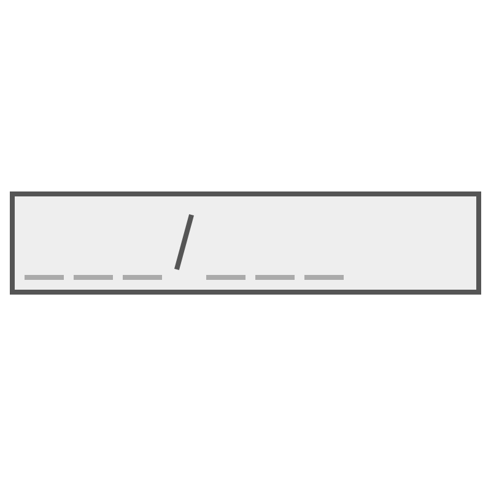

# TextBoxMask XAML Property

The **TextBoxMask Property** allows a user to more easily enter fixed width text in TextBox control where you would like them to enter the data in a certain format, ex: phone number, postal code.

### How it works

The developer adds the mask property to prevent end user to enter any other format but the required one, ex postal code aaa-9999

TextBox Mask property has 3 build in variable characters 
1) a which represents [a-Z]
2) 9 which represents [0-9]
3) '*' which represents a or 9

At the post code example the user will only be allowed to enter from a to Z in the first 3 characters then there is a fixed character (-) which the user can change or remove it and the last part which the user can change by entering from 0 to 9 at each character
TextBoxMask prevent the text box from having non specified characters ex if you entered 1 or 2 into a mask like 9999.

TextBoxMask has 2 type of characters 
1) Variable: which the user can change like a,9,*
2) Fixed: which the user can't change and it is any non variable character ex the - in the first example

Variable characters a represented to end user in form of placeholder so the user can know which characters he can change and which he can't, ex mask aaa-9999 will be presented to user as ___-____
the default placeholder is _ but you can change it using  extensions:TextBoxMask.PlaceHolder property (Check the second textbox in syntax section)

In case you want to add a custom variable character you can use property TextBoxMask.CustomMask (Check the third textbox in syntax section), you can add a character that represents certain regex as c:[a-c] and once you use character c in the mask the mask will prevent any characters but from a to c inside the TextBox, also you specify multiple variable characters by adding comma "," after every character and it's representation. this feature is helpful if you want to allow certain language characters ex French or Arabic only TextBox.

## Syntax

```xml

            <TextBox extensions:TextBoxMask.Mask="9a9a-a9a*"
                     Header="Text box with Mask 9a9a-a9a* (9 allows from 0 to 9, a allow from a to Z and * allows both a and 9)"
                      />

            <TextBox 
                     extensions:TextBoxMask.Mask="+1999-9999"
                     extensions:TextBoxMask.PlaceHolder=" "
                     Header="Text box with Mask +1999-9999 and placeHolder as space (placeholder represents the characters the user can change on runtime)"
                      />

            <TextBox
                     extensions:TextBoxMask.CustomMask="5:[1-5],c:[a-c]"
                     extensions:TextBoxMask.Mask="a5c-5c*9"
                     Header="Text box with CustomMask in case you want to define your own variable character like a,9 and * , mask: a5c-5c*9, 5: [1-5], c: [a-c]"
                     />

```


## Example Image



## Example Code

[TextBoxMask Sample Page](https://github.com/Microsoft/UWPCommunityToolkit/tree/master/Microsoft.Toolkit.Uwp.SampleApp/SamplePages/TextBoxMask)

The following sample demonstrates how to add TextBoxMask property.

```xml

<Page x:Class="Microsoft.Toolkit.Uwp.SampleApp.SamplePages.TextBoxMaskPage"
      xmlns="http://schemas.microsoft.com/winfx/2006/xaml/presentation"
      xmlns:x="http://schemas.microsoft.com/winfx/2006/xaml"
      xmlns:controls="using:Microsoft.Toolkit.Uwp.UI.Extensions"
      xmlns:d="http://schemas.microsoft.com/expression/blend/2008"
      xmlns:mc="http://schemas.openxmlformats.org/markup-compatibility/2006"
      mc:Ignorable="d">

    <Page.Resources>
        <Style x:Key="MaskedTextBoxStyle"
               TargetType="TextBox">
            <Setter Property="Margin" Value="10,0,10,0" />
            <Setter Property="VerticalAlignment" Value="Top" />
            <Setter Property="TextWrapping" Value="Wrap" />
        </Style>
        <DataTemplate x:Key="HeaderTemplate">
            <StackPanel>
                <TextBlock Text="{Binding}"
                           TextWrapping="WrapWholeWords" />
            </StackPanel>
        </DataTemplate>
    </Page.Resources>

    <Grid Background="{StaticResource Brush-Grey-05}">
        <Grid Margin="30">
            <Grid.RowDefinitions>
                <RowDefinition />
                <RowDefinition />
                <RowDefinition />
            </Grid.RowDefinitions>

            <TextBox extensions:TextBoxMask.Mask="9a9a-a9a*"
                     Header="Text box with Mask 9a9a-a9a* (9 allows from 0 to 9, a allow from a to Z and * allows both a and 9)"
                     HeaderTemplate="{StaticResource HeaderTemplate}"
                     Style="{StaticResource MaskedTextBoxStyle}" />

            <TextBox Grid.Row="1"
                     extensions:TextBoxMask.Mask="+1999-9999"
                     extensions:TextBoxMask.PlaceHolder=" "
                     Header="Text box with Mask +1999-9999 and placeHolder as space (placeholder represents the characters the user can change on runtime)"
                     HeaderTemplate="{StaticResource HeaderTemplate}"
                     Style="{StaticResource MaskedTextBoxStyle}" />

            <TextBox Grid.Row="2"
                     extensions:TextBoxMask.CustomMask="5:[1-5],c:[a-c]"
                     extensions:TextBoxMask.Mask="a5c-5c*9"
                     Header="Text box with CustomMask in case you want to define your own variable character like a,9 and * , mask: a5c-5c*9, 5: [1-5], c: [a-c]"
                     HeaderTemplate="{StaticResource HeaderTemplate}"
                     Style="{StaticResource MaskedTextBoxStyle}" />

        </Grid>
    </Grid>
</Page>


```

## Requirements (Windows 10 Device Family)

| [Device family](http://go.microsoft.com/fwlink/p/?LinkID=526370) | Universal, 10.0.10586.0 or higher |
| --- | --- |
| Namespace | Microsoft.Toolkit.Uwp.UI.Extensions |

## API

* [TextBoxMask source code](https://github.com/Microsoft/UWPCommunityToolkit/tree/master/Microsoft.Toolkit.Uwp.UI/Extensions/TextBoxMask)
